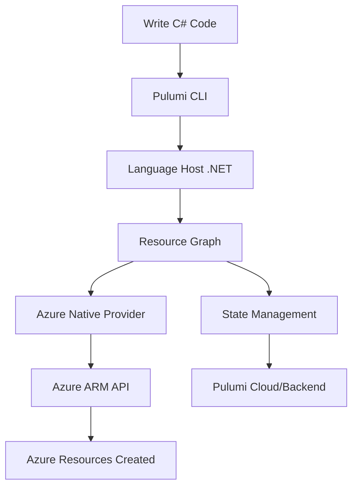

# Azure Function with Pulumi Infrastructure


A production-ready Azure Functions project with Infrastructure as Code using Pulumi (C#) and automated CI/CD deployment via GitHub Actions.

## 🚀 Features

- **Azure Functions v4** with isolated worker model
- **Configuration Management** with strongly-typed settings and Options pattern
- **Infrastructure as Code** using Pulumi C# SDK
- **Multi-Environment Support** (dev/staging/prod) with separate Azure resources
- **GitHub Actions CI/CD** with automatic deployment and infrastructure provisioning
- **Monitoring & Logging** with Application Insights integration

## 🌟 What is Pulumi?

**Pulumi** is a modern Infrastructure as Code (IaC) platform that allows you to define, deploy, and manage cloud infrastructure using familiar programming languages instead of YAML or domain-specific languages.

### 🆚 Pulumi vs Traditional IaC Tools

| Feature | Pulumi | Terraform | ARM Templates | CloudFormation |
|---------|--------|-----------|---------------|----------------|
| **Language** | C#, TypeScript, Python, Go | HCL (DSL) | JSON/Bicep | JSON/YAML |
| **Logic & Loops** | ✅ Full programming constructs | ⚠️ Limited | ❌ Very limited | ⚠️ Limited |
| **IDE Support** | ✅ IntelliSense, debugging | ⚠️ Basic | ⚠️ Basic | ⚠️ Basic |
| **Testing** | ✅ Unit tests, mocking | ⚠️ Limited | ❌ Manual | ❌ Manual |
| **Abstraction** | ✅ Classes, functions, packages | ⚠️ Modules | ❌ Nested templates | ⚠️ Nested stacks |
| **Multi-Cloud** | ✅ 120+ providers | ✅ Many providers | ❌ Azure only | ❌ AWS only |

### 🔄 How Pulumi Works



**Step-by-Step Process:**

1. **Write Infrastructure Code**: Define resources using C# classes and properties
2. **Pulumi Engine**: Analyzes your code and builds a dependency graph
3. **Planning**: Determines what changes need to be made (create/update/delete)
4. **Execution**: Calls cloud provider APIs to make changes
5. **State Management**: Tracks resource state for future operations

### 🎯 Why Pulumi with C# for This Project?

**1. Familiar Language & Tooling**
```csharp
// This looks familiar to .NET developers!
var resourceGroup = new ResourceGroup("azure-function-rg", new ResourceGroupArgs 
{
    Location = "East US"
});

var functionApp = new WebApp("azure-function-app", new WebAppArgs
{
    ResourceGroupName = resourceGroup.Name,
    Location = resourceGroup.Location,
    // IntelliSense helps with properties!
});
```

**2. Type Safety & IntelliSense**
- Compile-time error checking
- Auto-completion for Azure resource properties
- Rich IDE support with debugging capabilities

**3. Advanced Programming Constructs**
```csharp
// Loops, conditions, and logic
var environments = new[] { "dev", "staging", "prod" };
var functionApps = environments.Select(env => 
    new WebApp($"function-{env}", new WebAppArgs
    {
        // Environment-specific configuration
        SiteConfig = GetConfigForEnvironment(env)
    })
).ToArray();
```

**4. Reusable Components**
```csharp
// Create reusable infrastructure classes
public class AzureFunctionStack : ComponentResource
{
    public Output<string> FunctionAppUrl { get; }
    
    public AzureFunctionStack(string name, AzureFunctionStackArgs args)
    {
        // Encapsulate complex infrastructure patterns
    }
}
```

**5. Testing Infrastructure**
```csharp
[Test]
public async Task ShouldCreateFunctionApp()
{
    var resources = await Testing.RunAsync<MyStack>();
    var functionApps = resources.OfType<WebApp>();
    
    Assert.Single(functionApps);
    Assert.Equal("azure-function-app", functionApps.First().Name);
}
```

### 🏗️ Pulumi in This Project

Our infrastructure is defined in [`infrastructure/Program.cs`](infrastructure/Program.cs):

```csharp
// 1. Resource Group (container)
var resourceGroup = new ResourceGroup("azure-function-rg");

// 2. Storage Account (required for Functions)
var storageAccount = new StorageAccount("azfuncstore", new StorageAccountArgs
{
    ResourceGroupName = resourceGroup.Name,
    Sku = new SkuArgs { Name = SkuName.Standard_LRS }
});

// 3. Application Insights (monitoring)
var appInsights = new Component("azure-function-ai", new ComponentArgs
{
    ResourceGroupName = resourceGroup.Name,
    ApplicationType = ApplicationType.Web
});

// 4. App Service Plan (compute)
var appServicePlan = new AppServicePlan("azure-function-plan", new AppServicePlanArgs
{
    ResourceGroupName = resourceGroup.Name,
    Sku = new SkuDescriptionArgs { Name = "F1", Tier = "Free" }
});

// 5. Function App (main application)
var functionApp = new WebApp("azure-function-app", new WebAppArgs
{
    ResourceGroupName = resourceGroup.Name,
    ServerFarmId = appServicePlan.Id,
    SiteConfig = new SiteConfigArgs
    {
        AppSettings = new[]
        {
            new NameValuePairArgs { Name = "AzureWebJobsStorage", Value = storageConnectionString },
            new NameValuePairArgs { Name = "FUNCTIONS_EXTENSION_VERSION", Value = "~4" },
            // Environment-specific settings...
        }
    }
});
```

### 🎁 Key Benefits for Developers

1. **Reduced Learning Curve**: Use existing C# knowledge
2. **Better Collaboration**: Code reviews for infrastructure changes
3. **Version Control**: Track infrastructure changes like application code
4. **Automated Testing**: Unit test your infrastructure definitions
5. **Environment Consistency**: Same code deploys to dev/staging/prod
6. **IDE Integration**: Debugging, refactoring, and IntelliSense support

### 📈 Pulumi vs Configuration Files

**Traditional (ARM Template JSON)**:
```json
{
  "type": "Microsoft.Web/sites",
  "apiVersion": "2021-02-01",
  "name": "[parameters('functionAppName')]",
  "properties": {
    "serverFarmId": "[resourceId('Microsoft.Web/serverfarms', parameters('planName'))]",
    "siteConfig": {
      "appSettings": [
        {
          "name": "AzureWebJobsStorage",
          "value": "[concat('DefaultEndpointsProtocol=https;AccountName=', parameters('storageAccountName'))]"
        }
      ]
    }
  }
}
```

**Pulumi (C# Code)**:
```csharp
var functionApp = new WebApp("azure-function-app", new WebAppArgs
{
    ServerFarmId = appServicePlan.Id,
    SiteConfig = new SiteConfigArgs
    {
        AppSettings = new[]
        {
            new NameValuePairArgs 
            { 
                Name = "AzureWebJobsStorage", 
                Value = storageConnectionString 
            }
        }
    }
});
```

**Why Pulumi Wins**:
- ✅ **Type safety**: Compile-time error checking
- ✅ **IntelliSense**: Auto-completion and documentation
- ✅ **Refactoring**: Rename variables across entire codebase
- ✅ **Debugging**: Set breakpoints and inspect values
- ✅ **Modularity**: Extract methods and classes for reuse

### 🔧 Common Pulumi Setup Challenges & Solutions

During the development of this project, we encountered several common issues that developers might face:

#### **1. Authentication Issues**
**Problem**: "Authenticating using the Azure CLI is only supported as a User (not a Service Principal)"

**Solution**: Configure Service Principal environment variables directly:
```yaml
env:
  ARM_CLIENT_ID: ${{ fromJson(secrets.AZURE_CREDENTIALS).clientId }}
  ARM_CLIENT_SECRET: ${{ fromJson(secrets.AZURE_CREDENTIALS).clientSecret }}
  ARM_TENANT_ID: ${{ fromJson(secrets.AZURE_CREDENTIALS).tenantId }}
  ARM_SUBSCRIPTION_ID: ${{ fromJson(secrets.AZURE_CREDENTIALS).subscriptionId }}
```

#### **2. Project File Conflicts**
**Problem**: "Specify which project or solution file to use because this folder contains more than one project"

**Solution**: Separate infrastructure code into its own directory:
```
├── infrastructure/          # Isolated Pulumi project
│   ├── Infrastructure.csproj
│   ├── Program.cs
│   └── Pulumi.yaml
├── src/                     # Function app code
```

#### **3. Azure Quota Limitations**
**Problem**: "Current Limit (Dynamic VMs): 0" or "Current Limit (Basic VMs): 0"

**Important**: Azure Functions **cannot run on Free (F1) or Shared plans** - they require minimum Y1 or B1.

**Quick Solutions**:

**Option A: Try Different Region**
```bash
# Test regions with quota helper script
.\test-regions.ps1

# Set region for current stack
cd infrastructure
pulumi config set location "West US 2"
pulumi up
```

**Option B: Switch to Basic Plan** (current default)
```csharp
Sku = new SkuDescriptionArgs
{
    Name = "B1", // Basic tier (~$13/month, different quota pool)
    Tier = "Basic",
}
```

**Option C: Request Quota Increase**
1. Go to Azure Portal → Subscriptions → Usage + quotas
2. Search for "Dynamic VMs" and request increase to 10+
3. If denied, try "Basic VMs" quota increase instead
4. Approval usually takes 24 hours

#### **4. Application Insights Configuration**
**Problem**: "Cannot set LogAnalytics as IngestionMode without WorkspaceResourceId"

**Solution**: Explicitly set ingestion mode:
```csharp
new Component("azure-function-ai", new ComponentArgs
{
    ApplicationType = ApplicationType.Web,
    IngestionMode = IngestionMode.ApplicationInsights, // Avoid workspace requirement
});
```

### 📊 Pulumi State Management

Pulumi automatically manages infrastructure state through:

- **Cloud Backend**: State stored in Pulumi Cloud (free tier available)
- **Versioning**: Every deployment creates a new state version
- **Rollback**: Can rollback to previous states if needed
- **Collaboration**: Team members share the same state
- **Encryption**: State is encrypted at rest and in transit

Example workflow:
```bash
# Deploy infrastructure
pulumi up

# View current state
pulumi stack export

# Rollback to previous version
pulumi stack import --file previous-state.json

# View deployment history
pulumi stack history
```

## 🏗️ Architecture

```
azure-function-pulumi/
├── src/                          # Azure Function Code
│   ├── HelloWorldFunction.cs     # Hello World HTTP trigger
│   ├── ConfigDemoFunction.cs     # Configuration patterns demo
│   ├── EnvironmentDemoFunction.cs # Environment variables demo
│   ├── AppSettings.cs            # Strongly-typed configuration
│   └── Program.cs                # Function host setup
├── infrastructure/               # Pulumi Infrastructure Code
│   ├── Infrastructure.csproj     # Pulumi C# project
│   ├── Program.cs                # Infrastructure definition
│   └── Pulumi.yaml              # Pulumi project config
└── .github/workflows/           # CI/CD Pipelines
    ├── deploy.yml               # Build & Deploy workflow
    └── destroy.yml              # Safe infrastructure cleanup
```

## 🛠️ Prerequisites

- **Azure Subscription** with Contributor access
- **Azure CLI** installed and authenticated (`az login`)
- **.NET 6.0 SDK** or later
- **Pulumi Account** (free at https://app.pulumi.com)
- **Git** and **GitHub** repository

## ⚡ Quick Start

### 1. Clone and Setup
```bash
git clone https://github.com/tonyjoanes/azure-function-pulumi.git
cd azure-function-pulumi
```

### 2. Configure GitHub Secrets
Set up the following secrets in your GitHub repository:

- `AZURE_CREDENTIALS`: Azure service principal JSON (see [setup guide](DEPLOYMENT.md))
- `PULUMI_ACCESS_TOKEN`: Pulumi access token from https://app.pulumi.com

### 3. Deploy to Azure
Push to main branch or manually trigger the "Deploy to Azure" workflow:
```bash
git push origin main
```

### 4. Test Your Function
Once deployed, test the endpoints:
```bash
# Hello World
curl https://azure-function-pulumi-dev-func.azurewebsites.net/api/HelloWorld

# Configuration Demo
curl https://azure-function-pulumi-dev-func.azurewebsites.net/api/ConfigDemo

# Environment Variables
curl https://azure-function-pulumi-dev-func.azurewebsites.net/api/EnvironmentDemo
```

## 🌍 Multi-Environment Support

This project supports separate environments with isolated Azure resources:

| Environment | Trigger | Azure Resources | Default Region |
|-------------|---------|-----------------|----------------|
| **Dev** | Push to `main` | `azure-function-pulumi-dev-*` | East US |
| **Staging** | Pull Request | `azure-function-pulumi-staging-*` | West US 2 |
| **Prod** | Manual workflow dispatch | `azure-function-pulumi-prod-*` | Central US |

Each environment has its own:
- Resource Group
- Function App  
- Storage Account
- Application Insights
- Configuration values
- **Azure Region** (configurable per environment)

### 🌎 Regional Configuration

**Override region for any environment:**
```bash
cd infrastructure

# Set region for specific stack
pulumi stack select dev
pulumi config set location "West Europe"

# Deploy to new region
pulumi up
```

**Test different regions for quota:**
```bash
# Use helper script to find regions with available quota
.\test-regions.ps1

# Try the recommended region
pulumi config set location "West US 2"
pulumi up --dry-run  # Test first
```

## 🔧 Local Development

### Run Function Locally
```bash
cd src
dotnet restore
func start
```

### Deploy Infrastructure Locally
```bash
cd infrastructure
az login
pulumi login
pulumi stack select dev
pulumi up
```

### Local Testing Script
```bash
# Use the provided PowerShell script
.\deploy-local.ps1
```

## ⚙️ Configuration Management

The project demonstrates three configuration patterns:

1. **Direct IConfiguration Access**
```csharp
var setting = _configuration["MySetting"];
```

2. **Strongly-Typed Configuration**
```csharp
var appSettings = _configuration.GetSection("AppSettings").Get<AppSettings>();
```

3. **Options Pattern with Fallback**
```csharp
var maxRetries = _configuration.GetValue<int>("AppSettings:MaxRetries", 3);
```

## 🏗️ Infrastructure Resources

Each environment deploys:
- **Resource Group**: Container for all resources
- **Storage Account**: Required for Azure Functions runtime
- **Function App**: Serverless compute with consumption plan
- **Application Insights**: Monitoring and logging
- **Configuration**: Environment-specific app settings

## 🔄 CI/CD Pipeline

### Build & Deploy Workflow
1. **Build & Test**: Compile function code and run tests
2. **Infrastructure**: Deploy/update Azure resources with Pulumi
3. **Function Deploy**: Deploy function code to Azure
4. **Verification**: Health check and endpoint testing

### Destroy Workflow
Safe infrastructure cleanup requiring `DESTROY` confirmation:
```bash
# GitHub Actions -> Destroy Infrastructure
# Type: "DESTROY" to confirm
```

## 📊 Monitoring

- **Application Insights**: Automatic telemetry and logging
- **Health Endpoint**: `/api/ConfigHealth` for monitoring
- **GitHub Actions**: Build and deployment status badges

## 🛡️ Security

- **Azure Managed Identity**: For secure resource access
- **GitHub Secrets**: Encrypted credential storage
- **Principle of Least Privilege**: Minimal required permissions
- **Environment Isolation**: Separate resources per environment

## 🌟 Real-World Considerations

### **Cost Optimization**
- **Consumption Plan**: Y1 plan (pay-per-execution, can be $0-5/month for light usage)
- **Basic Plan**: B1 plan (~$13/month) for predictable costs
- **Resource Cleanup**: Use destroy workflows to avoid unnecessary costs
- **Monitoring**: Application Insights provides cost insights
- **Note**: Azure Functions cannot use Free (F1) tier - minimum is Y1 or B1

### **Security Best Practices**
- **Service Principal**: Minimal required permissions (Contributor role)
- **GitHub Secrets**: Encrypted storage for sensitive credentials
- **Environment Isolation**: Separate Azure resources per environment
- **Access Control**: Use Azure RBAC for team permissions

### **Scalability & Performance**
- **Auto-scaling**: Function Apps scale automatically based on demand
- **Cold Start**: Free tier may have cold start delays
- **Connection Pooling**: Configure efficient database connections
- **Monitoring**: Use Application Insights for performance insights

### **Team Collaboration**
- **Code Reviews**: Infrastructure changes go through PR process
- **Documentation**: Infrastructure as code serves as documentation
- **Shared State**: Pulumi Cloud enables team collaboration
- **Environment Parity**: Same code deploys to all environments

### **Deployment Strategies**
- **Blue-Green**: Deploy to staging, then promote to production
- **Canary**: Gradual rollout with traffic splitting
- **Feature Flags**: Runtime configuration without redeployment
- **Rollback**: Quick rollback to previous known-good state

### **Monitoring & Observability**
```csharp
// Custom telemetry in your functions
public static void Run([HttpTrigger] HttpRequest req, ILogger log)
{
    using var activity = StartActivity("ProcessRequest");
    activity?.SetTag("user.id", userId);
    
    try
    {
        // Your function logic
        log.LogInformation("Request processed successfully");
    }
    catch (Exception ex)
    {
        log.LogError(ex, "Request processing failed");
        activity?.SetStatus(ActivityStatusCode.Error);
        throw;
    }
}
```

## 📚 Learn More

- [Detailed Setup Guide](DEPLOYMENT.md)
- [Azure Functions Documentation](https://docs.microsoft.com/en-us/azure/azure-functions/)
- [Pulumi Azure Native Provider](https://www.pulumi.com/registry/packages/azure-native/)
- [GitHub Actions Documentation](https://docs.github.com/en/actions)
- [Pulumi C# Documentation](https://www.pulumi.com/docs/languages-sdks/dotnet/)
- [Azure Functions Best Practices](https://docs.microsoft.com/en-us/azure/azure-functions/functions-best-practices)

## 🤝 Contributing

1. Fork the repository
2. Create a feature branch
3. Make your changes
4. Test locally
5. Submit a pull request

## 📄 License

This project is licensed under the MIT License - see the [LICENSE](LICENSE) file for details.

## 🆘 Support

- **Issues**: [GitHub Issues](https://github.com/tonyjoanes/azure-function-pulumi/issues)
- **Discussions**: [GitHub Discussions](https://github.com/tonyjoanes/azure-function-pulumi/discussions)
- **Documentation**: Check the [DEPLOYMENT.md](DEPLOYMENT.md) guide

---

⭐ **Star this repository** if you find it helpful! 